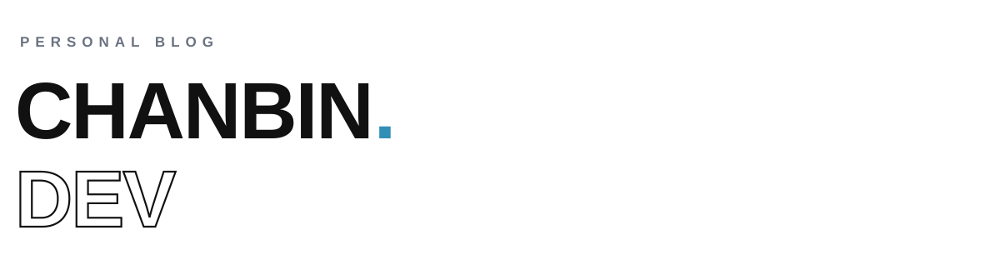

<picture>
  <source media="(prefers-color-scheme: dark)" srcset="assets/header-dark.svg" />
  
</picture>

노션에 글을 쓰고, 버튼 하나로 [chanbin.dev](https://chanbin.dev)에 올립니다.

<br />

<picture>
  <source media="(prefers-color-scheme: dark)" srcset="assets/label-how-dark.svg" />
  
</picture>

글의 정본은 노션입니다. 화면은 노션을 직접 조회하지 않습니다 - 동기화가 채워 둔 DB만 읽습니다. 렌더 경로에 외부 서비스가 끼면 그 장애가 곧 사이트 장애가 되기 때문입니다.

```
노션에서 글을 쓴다
  ↓  발행 체크 → 북마크 한 번 누름 (/api/sync)
노션 마크다운 → 우리 마크다운으로 변환
  ↓  콜아웃·토글·컬럼·형광펜·표를 옮기고, 못 옮긴 것은 이름을 보고한다
그림은 R2로 옮긴다
  ↓  노션이 주는 주소는 한 시간이면 만료된다
Supabase에 반영 (바뀐 글만)
  ↓  캐시를 버리고 곧바로 데운다
chanbin.dev
```

**바뀐 글만 씁니다.** 내용이 같으면 아예 건드리지 않습니다. 그래야 `updated_at`이 진짜 수정 시각을 말하고, 사이트맵의 `lastmod`가 크롤러에게 거짓말하지 않습니다.

**동기화가 끝나면 캐시를 버리고 데웁니다.** 버리기만 하면 그다음 첫 방문자가 옛 화면을 받습니다 - 글을 쓰고 바로 확인하는 사람이 늘 그 첫 방문자입니다.

<br />

<picture>
  <source media="(prefers-color-scheme: dark)" srcset="assets/label-stack-dark.svg" />
  
</picture>

`Next.js 15` App Router · `TypeScript` · `Tailwind v4` · `Supabase` · `Cloudflare R2` · `Notion API` · `giscus` · `Vercel`

공개 화면은 전부 정적으로 굽고 한 시간마다 다시 확인합니다. 읽는 데 쿠키가 필요 없어서 가능한 일입니다 - 로그인이 없는 사이트에서 세션을 읽으면 모든 화면의 캐시를 포기하게 됩니다.

<br />

<picture>
  <source media="(prefers-color-scheme: dark)" srcset="assets/label-local-dark.svg" />
  
</picture>

```bash
pnpm install
cp .env.local.example .env.local   # 노션·Supabase·R2 값을 채웁니다
pnpm dev
```

```bash
pnpm check        # 대비 · 노션 변환 · 검색 노출
pnpm lint         # eslint
pnpm build        # 서버·클라이언트 경계는 이것만 잡습니다
```

눈으로 보는 검사는 언젠가 건너뛰게 되므로, 지키고 싶은 것은 스크립트로 만들어 뒀습니다. 설계 판단과 버린 시도는 [`docs/adr`](./docs/adr)에 남깁니다.

<sub>© 2026 박찬빈 · <a href="https://chanbin.dev">chanbin.dev</a> · <a href="https://portfolio.chanbin.dev">portfolio</a></sub>
